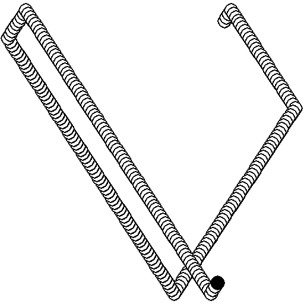
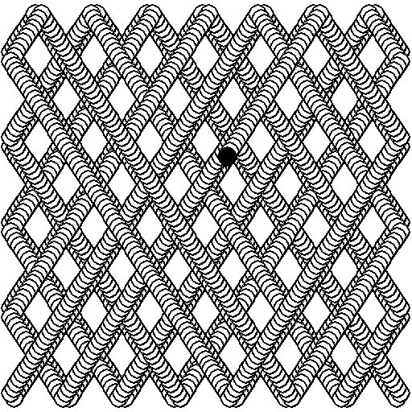

## Bouncing ball

Bouncing Ball animation



Traced patch of the bouncling ball animation



Dependencies for installing pygame on ubuntu 20.04

```shell
sudo apt install python-dev libsdl-image1.2-dev libsdl-mixer1.2-dev libsdl-ttf2.0-dev libportmidi-dev libfreetype6-dev
```
